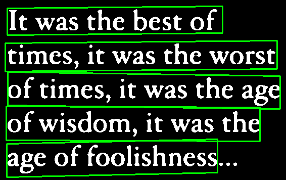

# Document OCR

## About
OCR for printed-document format using ResNet50 and ResNet101, with Chars74K dataset.
You can get all information of this dataset for further development in this site [The Chars74K dataset](https://info-ee.surrey.ac.uk/CVSSP/demos/chars74k/).

## Installation

1. Clone repo

    ```cmd
    git clone https://github.com/fikri1515/document_ocr.git
    ```

2. Installing Python Packages

    you can creating new python virtual environtment and install all packages with pip below.
    installing all packages using requirements.txt
    ```cmd
    pip install -r requirements.txt
    ```

## Example of Usage
for now this repo only provide CLI example of usage.

default of used model is ResNet50, you can run and save result like script below.
```cmd
python main.py -i "path_to_image" --display --write
```

for run ResNet101 model and save the result, you can run this.
```cmd
python main.py -i "path_to_image" --display --write --model "ResNet101"
```

### CLI Usage
this is example of CLI usage with some text image

#### original image


#### output
```cmd
> python main.py -i "demo_data/tx.png" --display
2025-03-01 23:29:47.610509: I tensorflow/core/util/port.cc:153] oneDNN custom operations are on. You may see slightly different numerical results due to floating-point round-off errors from different computation orders. To turn them off, set the environment variable `TF_ENABLE_ONEDNN_OPTS=0`.
2025-03-01 23:29:49.389428: I tensorflow/core/util/port.cc:153] oneDNN custom operations are on. You may see slightly different numerical results due to floating-point round-off errors from different computation orders. To turn them off, set the environment variable `TF_ENABLE_ONEDNN_OPTS=0`.
[info] image successfully loaded
[info] preprocessing image
[info] loading model from model_path: models\ResNet\ResNet50\checkpoint.ResNet50.keras
2025-03-01 23:29:57.003416: I tensorflow/core/platform/cpu_feature_guard.cc:210] This TensorFlow binary is optimized to use available CPU instructions in performance-critical operations.
To enable the following instructions: AVX2 AVX512F AVX512_VNNI FMA, in other operations, rebuild TensorFlow with the appropriate compiler flags.
[info] creating batch dataset
[info] batch dataset created
[info] len of batches is 3, with size per batch: 32
processing batches:   0%|                                                                        | 0/3 [00:00<?, ?it/s]Batch 1/3 processed
processing batches:  33%|█████████████████████▎                                          | 1/3 [00:02<00:05,  3.00s/it]Batch 2/3 processed
processing batches:  67%|██████████████████████████████████████████▋                     | 2/3 [00:03<00:01,  1.66s/it]Batch 3/3 processed
processing batches: 100%|████████████████████████████████████████████████████████████████| 3/3 [00:05<00:00,  1.89s/it]2025-03-01 23:30:10.495361: I tensorflow/core/framework/local_rendezvous.cc:405] Local rendezvous is aborting with status: OUT_OF_RANGE: End of sequence
processing batches: 100%|████████████████████████████████████████████████████████████████| 3/3 [00:05<00:00,  1.96s/it]
[info] result time for batch prediction: 5.89 seconds
[info] displaying results

It waS the deSt of
timeSr it waS thc worSt
of timeS7 it waS the age
of wiSdomr it waS the
age of fooliShneSS
```

## For Developer
We create this repo with OOP concept and layered architecture, for further developing purpose.
you can see the example of visualization below.

### detecting line image using DB_TD500_resnet18 models

- #### text detected image with thresholding
    

- #### cropping line image with word detected
    

- #### cropping word image with char detected
    

## License

This project is licensed under the [MIT License](LICENSE).
